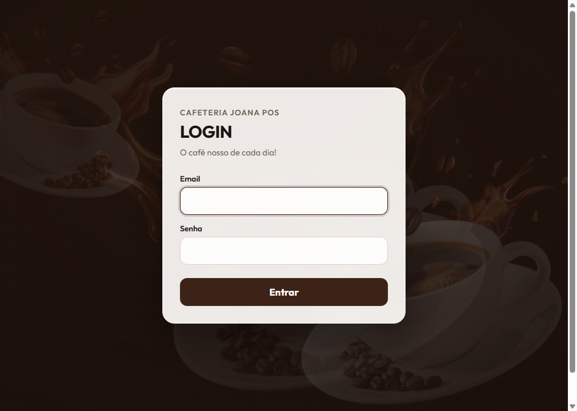
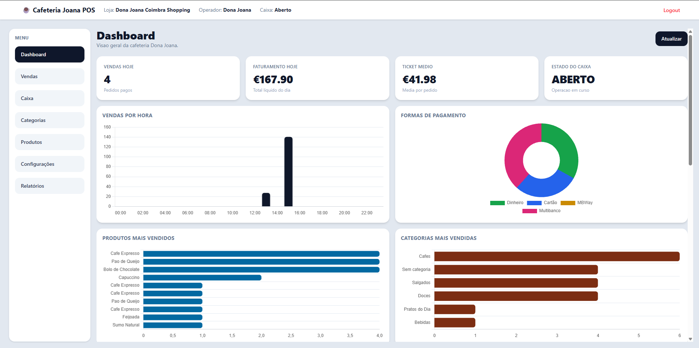
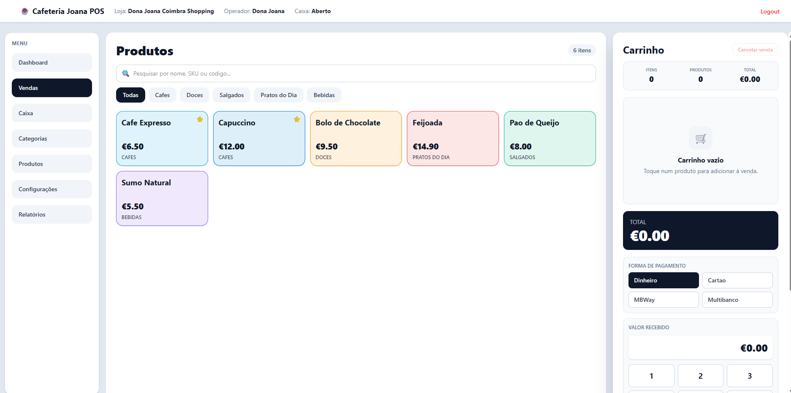
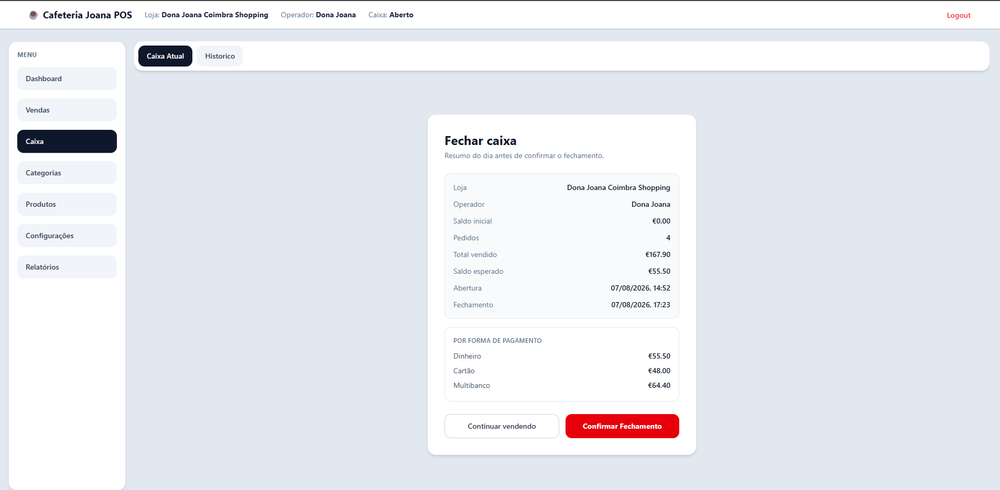
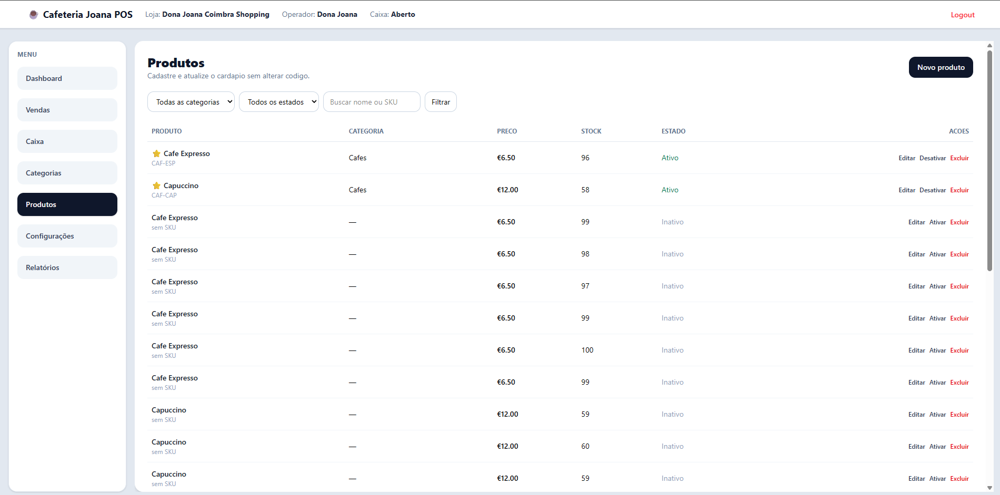
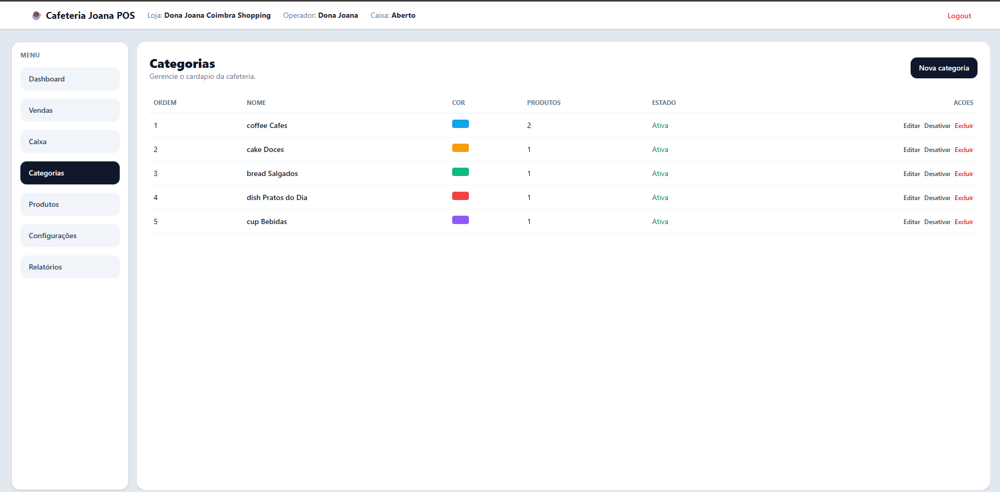
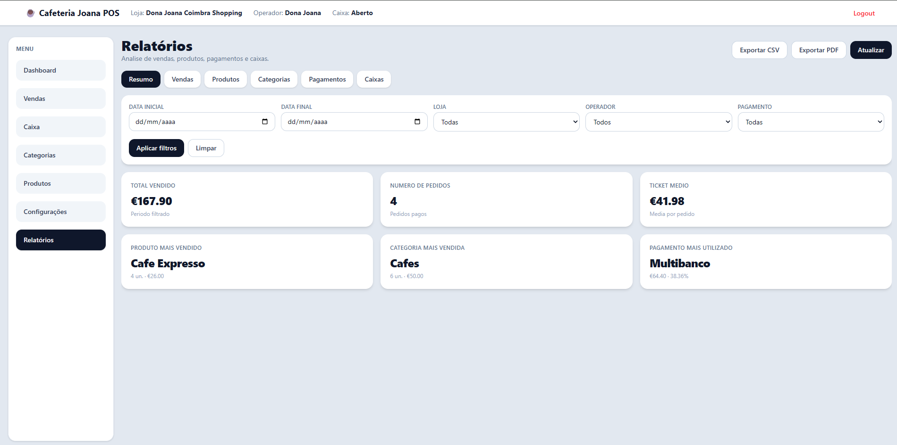
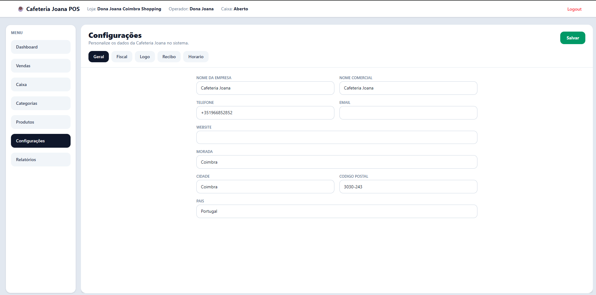

<p align="center">
  
</p>

<h1 align="center">POS System</h1>

<p align="center">
  <strong>Sistema de ponto de venda para operação de balcão</strong>
</p>

<p align="center">
  <a href="docs/releases/CHANGELOG.md"></a>
  
  
  
  
  
  <a href="LICENSE"></a>
</p>

---

## Descrição

PDV full-stack para cafeteria/balcão: login, loja, caixa, vendas, pagamentos, recibo, dashboard, catálogo, relatórios e configurações.

Construído com **Laravel 12** + **Vue 3**, com arquitetura em camadas `Controller → Service → Model`, pensado como projeto de **portfólio**.

---

## Tecnologias

| Camada | Stack |
|--------|--------|
| Backend | PHP 8.4 · Laravel 12 · Eloquent · Form Requests · Enums |
| Frontend | Vue 3 (Composition API) · Tailwind CSS 4 · Vite 6 |
| HTTP | Axios + sessão Laravel + CSRF |
| UI | vue-sonner · Chart.js |
| Impressão | HTML + CSS `@media print` |
| Base de dados | MySQL (SQLite em desenvolvimento) |

---

## Screenshots

<table>
  <tr>
    <td align="center" width="50%">
      <br />
      <em>Login</em>
    </td>
    <td align="center" width="50%">
      <br />
      <em>Dashboard</em>
    </td>
  </tr>
  <tr>
    <td align="center">
      <br />
      <em>Vendas</em>
    </td>
    <td align="center">
      <br />
      <em>Caixa</em>
    </td>
  </tr>
  <tr>
    <td align="center">
      <br />
      <em>Produtos</em>
    </td>
    <td align="center">
      <br />
      <em>Categorias</em>
    </td>
  </tr>
  <tr>
    <td align="center">
      <br />
      <em>Relatórios</em>
    </td>
    <td align="center">
      <br />
      <em>Configurações</em>
    </td>
  </tr>
</table>

---

## Funcionalidades

- Autenticação por sessão (login / logout)
- Seleção de loja
- Abertura, fecho e histórico de caixa
- Catálogo de produtos e categorias (CRUD)
- Vendas com grelha, pesquisa, carrinho e atalhos de teclado
- Pagamentos: dinheiro (troco), cartão, MBWay e Multibanco
- Recibo e comanda de cozinha (impressão HTML)
- Dashboard com indicadores e gráficos
- Relatórios filtráveis
- Configurações da empresa (logo, NIF, IVA, rodapé do recibo)

---

## Arquitetura

```
Vue 3 (POS)  →  Axios + CSRF  →  Laravel API (/api/v1)
                                       │
                             Controller → Service → Model
```

- Controllers finos (HTTP + JSON)
- Services com regras de negócio
- Models Eloquent + Enums tipados
- Sem Vue Router e sem Pinia

Detalhes: [`docs/architecture/ARCHITECTURE.md`](docs/architecture/ARCHITECTURE.md)

---

## Estrutura do projeto

```
pos-system/
├── app/
│   ├── Enums/
│   ├── Http/Controllers/Api/V1/
│   ├── Http/Requests/
│   ├── Models/
│   └── Services/
├── docs/
│   ├── api/
│   ├── architecture/
│   ├── project/
│   ├── releases/
│   └── screenshots/
├── resources/js/pos/
├── routes/
├── LICENSE
└── README.md
```

---

## Instalação

**Pré-requisitos:** PHP 8.4+, Composer, Node.js 20+, MySQL (ou SQLite)

```bash
composer install
npm install
cp .env.example .env
php artisan key:generate
# configurar DB no .env
php artisan migrate --seed
php artisan storage:link
npm run dev          # ou: npm run build
php artisan serve
```

Abrir: [http://127.0.0.1:8000](http://127.0.0.1:8000)

---

## Login padrão

Após `php artisan migrate --seed`:

| Campo | Valor |
|-------|--------|
| Email | `admin@pos-system.com` |
| Password | `admin123456789` |

---

## APIs

Prefixo: `/api/v1`

| Grupo | Endpoints |
|-------|-----------|
| Products | listar, detalhe, CRUD, activate/deactivate |
| Categories | listar, active, CRUD, activate/deactivate |
| Stores | index, active |
| Orders | index, store, show, add item |
| Cash | open, current, close, history, show |
| Dashboard | index |
| Settings | CRUD + current |
| Reports | summary, sales, products, categories, payments, cash-registers |

Documentação completa: [`docs/api/API.md`](docs/api/API.md)

---

## Roadmap

### v1.0

- [x] Login, loja e caixa
- [x] Vendas e pagamentos
- [x] Recibo / comanda
- [x] Dashboard, catálogo, relatórios e settings

### Futuro

- [ ] Impressão térmica
- [ ] Clientes
- [ ] Cupões / descontos
- [ ] Multiempresa
- [ ] Estoque avançado
- [ ] PWA / offline

---

## Documentação complementar

| Documento | Conteúdo |
|-----------|----------|
| [docs/README.md](docs/README.md) | Índice |
| [docs/api/API.md](docs/api/API.md) | Rotas REST |
| [docs/architecture/ARCHITECTURE.md](docs/architecture/ARCHITECTURE.md) | Arquitetura |
| [docs/project/PROJECT_ANALYSIS.md](docs/project/PROJECT_ANALYSIS.md) | Análise do projeto |
| [docs/releases/CHANGELOG.md](docs/releases/CHANGELOG.md) | Histórico de versões |
| [docs/releases/RELEASE_1.0.md](docs/releases/RELEASE_1.0.md) | Release 1.0 |
| [docs/screenshots/README.md](docs/screenshots/README.md) | Screenshots |

---

## Licença

MIT — ver [`LICENSE`](LICENSE).

---

<p align="center">
  <sub>Projeto de portfólio · Enrique</sub>
</p>
